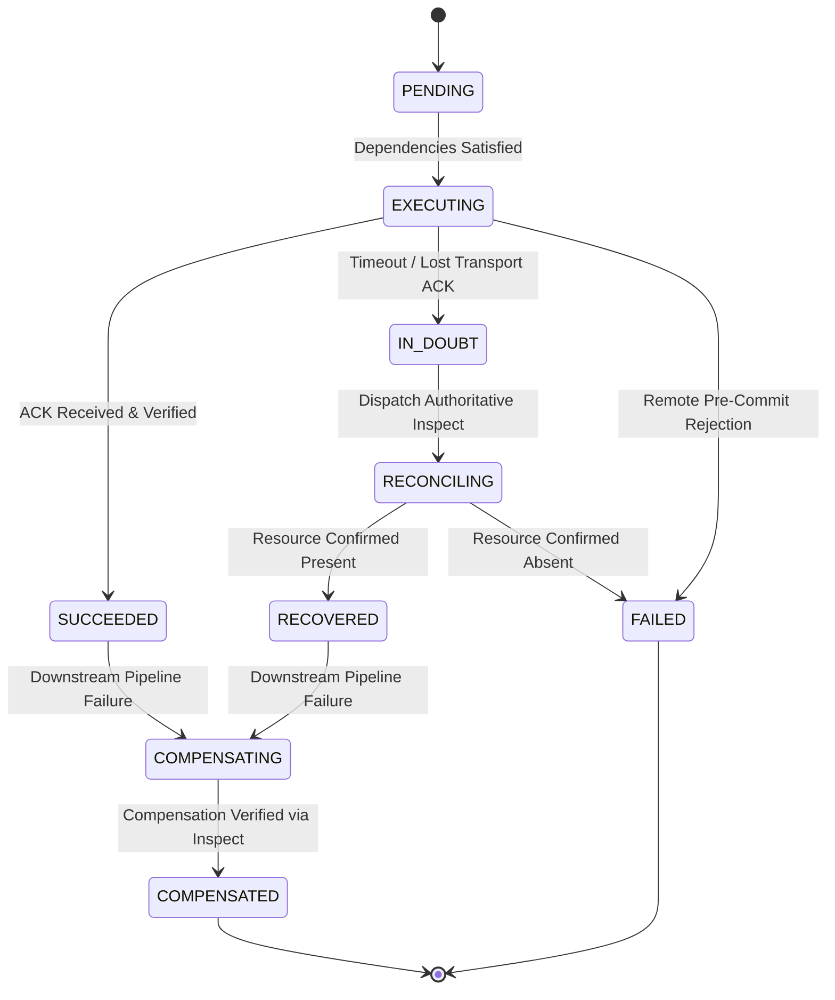

# MCPx Reliability Model

This document specifies the transaction state machine, uncertainty resolution semantics, and compensation guarantees implemented in MCPx.

---

## 1. The Core Distributed Challenge

In distributed systems and WebMCP browser orchestration:
> **A timeout or lost acknowledgement does NOT prove a write failed.**

If a remote service commits a write to its storage engine but the network packet or transport response frame is lost:
1. A **naive retry** will execute a duplicate write, resulting in resource duplication, double billing, or corrupted states.
2. A **naive abort** leaves orphaned external resources running indefinitely.

MCPx addresses this fundamental uncertainty by separating **Action Execution** from **Authoritative Ground Truth Inspection**.

---

## 2. Transaction Node State Machine

---

## 3. State Definitions

| State | Semantic Meaning | Next Allowed Action |
| :--- | :--- | :--- |
| **`PENDING`** | Waiting for prerequisite DAG steps to complete. | Transition to `EXECUTING`. |
| **`EXECUTING`** | WebMCP RPC mutation dispatched to target origin. | Transition to `SUCCEEDED`, `IN_DOUBT`, or `FAILED`. |
| **`SUCCEEDED`** | Mutation acknowledged and confirmed by target service. | Progress dependent child nodes. |
| **`IN_DOUBT`** | Transport frame lost or timed out. State is indeterminate. | Dispatch Authoritative Inspection (`RECONCILING`). |
| **`RECONCILING`** | Querying target `inspect` tool for ground truth. | Transition to `RECOVERED` or `FAILED`. |
| **`RECOVERED`** | Remote resource confirmed present; write succeeded despite lost ACK. | Progress dependent child nodes without duplicate writes. |
| **`FAILED`** | Definitive pre-commit rejection confirmed by service. | Trigger rollback and compensation. |
| **`COMPENSATING`** | Invoking compensating tool to reverse mutation. | Verify absence via `inspect`. |
| **`COMPENSATED`** | Authoritative inspection confirms remote resource is deleted. | Terminal rollback state. |

---

## 4. Authoritative Inspection Protocol

When a node enters `IN_DOUBT`:
1. MCPx freezes downstream step execution.
2. MCPx retrieves the contract's designated `inspectToolName` (e.g. `get_route`).
3. MCPx executes the inspect tool with the correlated `operationKey`.
4. If the inspect response returns `{ exists: true, resourceId: ... }`:
   - MCPx extracts the resource ID and marks the node `RECOVERED`.
   - Pipeline execution resumes seamlessly.
5. If the inspect response returns `{ exists: false }`:
   - MCPx marks the node `FAILED`.
   - Pipeline triggers compensation.

---

## 5. Reverse Compensation Guarantee

When an unrecoverable failure occurs in step $N$:
1. Execution halts immediately across all concurrent branches.
2. All upstream completed steps ($1 \dots N-1$) are identified.
3. Steps are sorted in **reverse topological dependency order** (reverse topological order).
4. If configured with a safety gate, MCPx halts in `AWAITING_COMPENSATION_APPROVAL` for operator review.
5. Upon approval, each compensating tool is executed sequentially.
6. Following each compensation RPC, an inspect query is executed to verify **authoritative absence** (`exists: false`) before declaring the step `COMPENSATED`.
